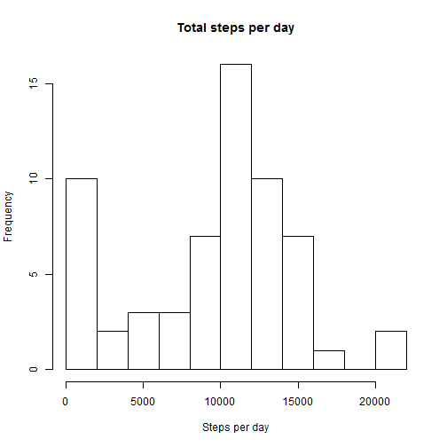
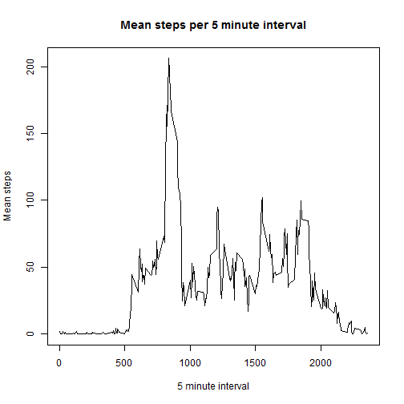
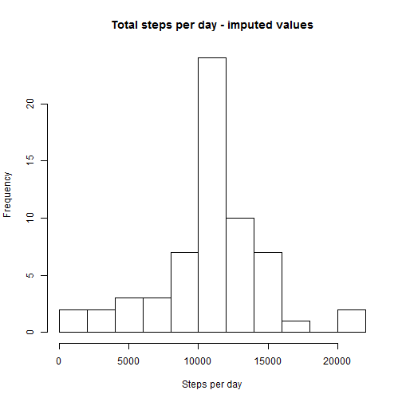
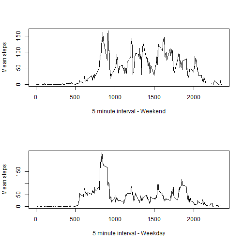

title: "Reproducible Research Course Project 1"
output: md

##Reproducible Research Course Project 1


#Background

The assignment asks the student to write a report answering a number of questions about the following data. 

*It is now possible to collect a large amount of data about personal movement using activity monitoring devices such as a Fitbit, Nike Fuelband, or Jawbone Up. These type of devices are part of the "quantified self" movement - a group of enthusiasts who take measurements about themselves regularly to improve their health, to find patterns in their behavior, or because they are tech geeks. But these data remain under-utilized both because the raw data are hard to obtain and there is a lack of statistical methods and software for processing and interpreting the data.*

*This assignment makes use of data from a personal activity monitoring device. This device collects data at 5 minute intervals through out the day. The data consists of two months of data from an anonymous individual collected during the months of October and November, 2012 and include the number of steps taken in 5 minute intervals each day.*

*The data for this assignment can be downloaded from the course web site:*

Dataset: [Activity monitoring data (52K)] (https://d396qusza40orc.cloudfront.net/repdata%2Fdata%2Factivity.zip)

*The variables included in this dataset are:*

 - *steps: Number of steps taking in a 5-minute interval (missing values are coded as NA)*

 - *date: The date on which the measurement was taken in YYYY-MM-DD format*

 - *interval: Identifier for the 5-minute interval in which measurement was taken*

*The dataset is stored in a comma-separated-value (CSV) file and there are a total of 17,568 observations in this dataset.*


#Loading and processing the data

*Show any code that is needed to*

1. *Load the data (i.e. read.csv())*
2. *Process/transform the data (if necessary) into a format suitable for your analysis*

This code assumes that the data is already downloaded and unzipped in the user's working directory.

It reads the .csv file, formats the date, and loads the dplyer package for use later in the code. 


```r
activity<-read.csv("activity.csv", header=TRUE, na.strings="NA")

activity$date<-as.Date(activity$date)

library(dplyr)
```

```
## 
## Attaching package: 'dplyr'
```

```
## The following objects are masked from 'package:stats':
## 
##     filter, lag
```

```
## The following objects are masked from 'package:base':
## 
##     intersect, setdiff, setequal, union
```

```r
head(activity)
```

```
##   steps       date interval
## 1    NA 2012-10-01        0
## 2    NA 2012-10-01        5
## 3    NA 2012-10-01       10
## 4    NA 2012-10-01       15
## 5    NA 2012-10-01       20
## 6    NA 2012-10-01       25
```

#What is mean total number of steps taken per day?

*For this part of the assignment, you can ignore the missing values in the dataset.*

1. *Calculate the total number of steps taken per day*

2. *If you do not understand the difference between a histogram and a barplot, research the difference between them. Make a histogram of the total number of steps taken each day* 

3. *Calculate and report the mean and median of the total number of steps taken per day*


Calculate the total number of steps taken per day:


```r
#group by date
by_date<-group_by(activity, date)

#Calculate the total number of steps taken per day
sum_steps<-summarize(by_date, tot=sum(steps, na.rm=TRUE))

sum_steps
```

```
## Source: local data frame [61 x 2]
## 
##          date   tot
##        (date) (int)
## 1  2012-10-01     0
## 2  2012-10-02   126
## 3  2012-10-03 11352
## 4  2012-10-04 12116
## 5  2012-10-05 13294
## 6  2012-10-06 15420
## 7  2012-10-07 11015
## 8  2012-10-08     0
## 9  2012-10-09 12811
## 10 2012-10-10  9900
## ..        ...   ...
```
Make a histogram of the total number of steps taken each day:


```r
hist(sum_steps$tot, xlab = "Steps per day", main="Total steps per day", breaks=10)
```



Calculate and report the mean and median of the total number of steps taken per day:

```r
#Mean
mean(sum_steps$tot)
```

```
## [1] 9354.23
```

```r
#Median
median(sum_steps$tot)
```

```
## [1] 10395
```

#What is the average daily activity pattern?

1. *Make a time series plot (i.e. type = "l") of the 5-minute interval (x-axis) and the average number of steps taken, averaged across all days (y-axis)*

2. *Which 5-minute interval, on average across all the days in the dataset, contains the maximum number of steps?*


Make a time series plot of the 5-minute interval and the average number of steps taken, averaged across all days:


```r
#Get the average number of steps by time interval across all days 
by_time<-group_by(activity, interval)
mean_steps<-summarize(by_time, mn=mean(steps, na.rm=TRUE))

#plot steps vs interval
with(mean_steps, plot(interval, mn, type="l", main="Mean steps per 5 minute interval", ylab="Mean steps", xlab="5 minute interval"))
```



Find the 5-minute interval with the maximum number of steps:


```r
filter(mean_steps, mn==max(mn, na.rm=TRUE))
```

```
## Source: local data frame [1 x 2]
## 
##   interval       mn
##      (int)    (dbl)
## 1      835 206.1698
```

This identifies which interval and its value. This looks consistent with what the plot above shows. 

#Imputing missing values

*Note that there are a number of days/intervals where there are missing values (coded as NA). The presence of missing days may introduce bias into some calculations or summaries of the data.*

1. *Calculate and report the total number of missing values in the dataset (i.e. the total number of rows with NAs)*

2. *Devise a strategy for filling in all of the missing values in the dataset. The strategy does not need to be sophisticated. For example, you could use the mean/median for that day, or the mean for that 5-minute interval, etc.*

3. *Create a new dataset that is equal to the original dataset but with the missing data filled in.*

4. *Make a histogram of the total number of steps taken each day and Calculate and report the mean and median total number of steps taken per day. Do these values differ from the estimates from the first part of the assignment? What is the impact of imputing missing data on the estimates of the total daily number of steps?*


Calculate the number of missing values in the dataset:


```r
sapply(activity, function(x) sum(is.na(x)))
```

```
##    steps     date interval 
##     2304        0        0
```

Devise a strategy for filling in all of the missing values in the dataset:

Here, we will assume that any missing values are equal to the mean of that 5 minute interval averaged across all days. 

Create a new dataset:

```r
#Make a new dataset which has the mean by interval. If the steps are NA, replace them with the mean for that interval.
activity2<-merge(activity, mean_steps, by="interval")
activity2<-(mutate (activity2, steps= round(ifelse(is.na(steps), mn, steps), digits=2)))

#Make sure everything is in the same order as the original dataframe
activity2<-activity2[order(activity2$date, activity2$interval),c('steps','date','interval')]

head(activity2)
```

```
##     steps       date interval
## 1    1.72 2012-10-01        0
## 63   0.34 2012-10-01        5
## 128  0.13 2012-10-01       10
## 205  0.15 2012-10-01       15
## 264  0.08 2012-10-01       20
## 327  2.09 2012-10-01       25
```
The dataset looks the same as the original but with the NAs filled in with the mean. 

Make a histogram:


```r
#group by date
by_date2<-group_by(activity2, date)
sum_steps2<-summarize(by_date2, tot=sum(steps))

#Make a histogram of the total number of steps taken each day 
hist(sum_steps2$tot, xlab = "Steps per day", main="Total steps per day - imputed values", breaks=10)
```



Report the mean and median:


```r
#Mean
mean(sum_steps2$tot)
```

```
## [1] 10766.18
```

```r
#Median
median(sum_steps2$tot)
```

```
## [1] 10766.13
```

Do these values differ from the estimates from the first part of the assignment? What is the impact of imputing missing data on the estimates of the total daily number of steps?

We can see that imputing the values in this way raises both the mean and the median. 

#Are there differences in activity patterns between weekdays and weekends?

*For this part the weekdays() function may be of some help here. Use the dataset with the filled-in missing values for this part.*

1. *Create a new factor variable in the dataset with two levels - "weekday" and "weekend" indicating whether a given date is a weekday or weekend day.*

2. *Make a panel plot containing a time series plot (i.e. type = "l") of the 5-minute interval (x-axis) and the average number of steps taken, averaged across all weekday days or weekend days (y-axis). See the README file in the GitHub repository to see an example of what this plot should look like using simulated data.*

Create a new factor variable in the dataset for weekday:


```r
#Create the factor variable Day using the weekdays function
activity_day<-mutate(activity2, Day = as.factor(ifelse(weekdays(activity2$date, abbreviate = TRUE) %in% c('Sat', 'Sun') ,"weekend", "weekday")))
```


Make a panel plot:


```r
#Summarize by Day and interval and split out by Day
by_time_day<-group_by(activity_day, interval, Day)
mean_steps_day<-summarize(by_time_day, mn=mean(steps))
mean_steps_weekday<-mean_steps_day[which(mean_steps_day$Day == "weekday"),]
mean_steps_weekend<-mean_steps_day[which(mean_steps_day$Day == "weekend"),]

#Set up the panels
par(mfrow=c(2,1))

#plot the two datasets
with(mean_steps_weekend, plot(interval, mn, type="l",  ylab="Mean steps", xlab="5 minute interval - Weekend"))
with(mean_steps_weekday, plot(interval, mn, type="l", , ylab="Mean steps", xlab="5 minute interval - Weekday"))
```



Note that I've used the base plotting system instead of lattice as in the example plot, but per the README file, *"you can make the same version of the plot using any plotting system you choose"*. This shows the same information. 

There does seem to be seome difference in activity between weekends and weekdays. 


